# Building a Book Selling Application on Android
The purpose of building the application is:
   - Firstly, it is to research programming technologies such as Android application development.
   - Secondly, it is to develop a highly practical application with the capability to deploy it in real-world scenarios, enabling users with the need to purchase books to navigate the application easily and conveniently.

## Installation Guide
   - Installing the Java package: https://www.oracle.com/java/technologies/downloads/
   - Download Android Studio software: https://developer.android.com/studio
   - Download Genymotion: https://www.genymotion.com/product-desktop/download/
   - Installing Xampp: You can download the latest version. Link download: https://www.apachefriends.org/download.html

 ## System Requirements
   - The management system is built on the website using HTML, CSS, JavaScript, and PHP.
   - The application is developed using the Java programming language.
   - MySQL database.

## System Functions
* **Administrator Functions::**
    - Log in to the system management website.
    - Manage book categories: Add, delete, edit information about book types, authors, and categories.
    - Order management: Process, resolve orders, handle payments, and deliver to customers.
    - Book management: Add, edit, delete information about books, update quantities in stock, and indicate if a book is in or out of stock.
    - Monitor the list of feedback from customers.
* **Customer Functions::**
    - First, customers need to register an account, then log in to the system.
    - Search: Customers can search for books by title, author's name, or genre.
    - View detailed information about a book (content, genre, author's name).
    - View detailed information about a book (content, genre, author's name).
    - Manage their placed orders and provide feedback, ratings, and comments to the Administrator.

## Demo
Home Page    
 
Menu Category    

Best-selling book page    

Product Details Page   

Shopping Cart Page   

Order Page    

Registration Page    

Login Page     

Admin Home Page
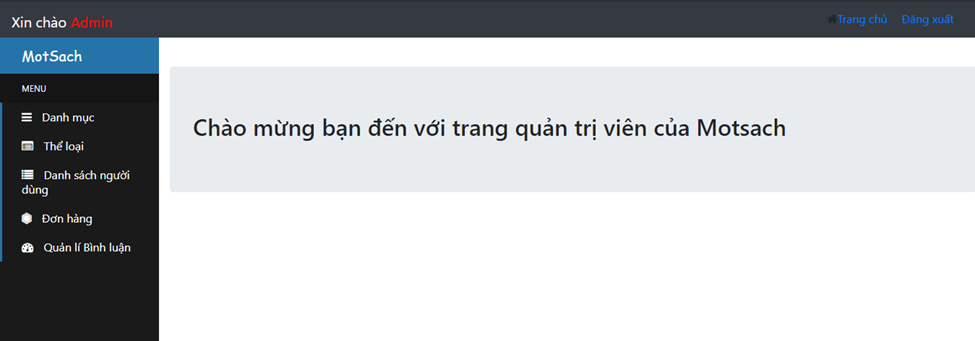
Category Management Page
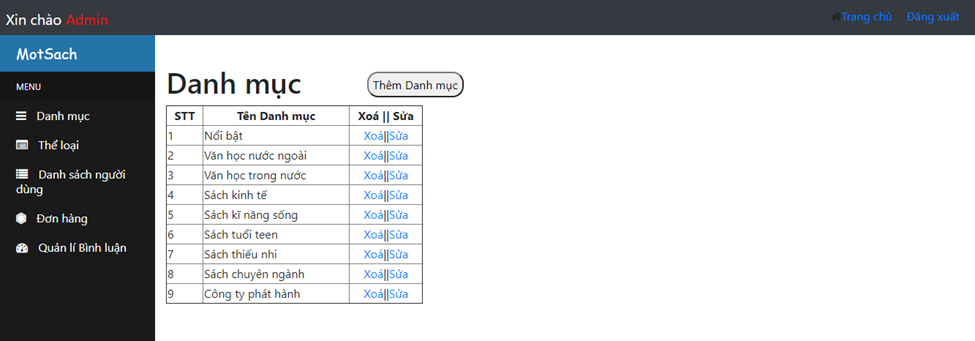
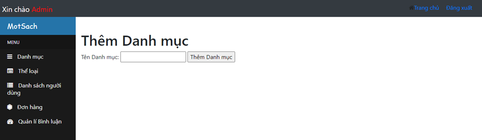
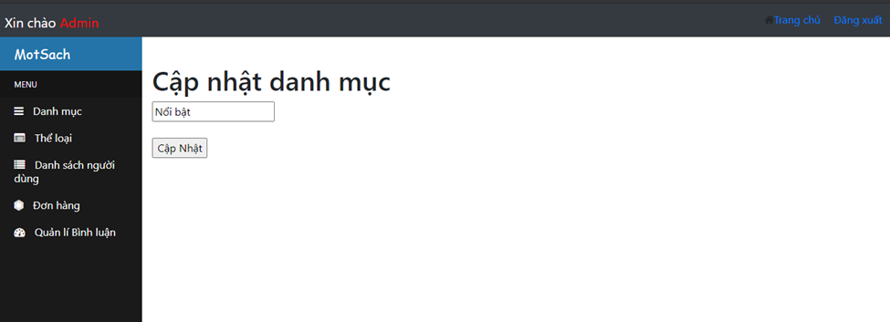
Genre Management Page
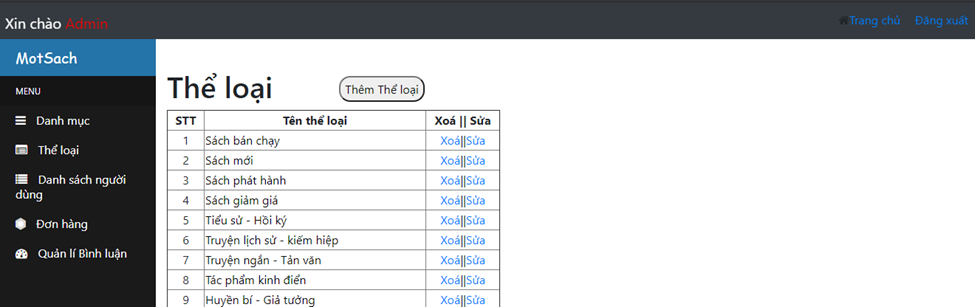
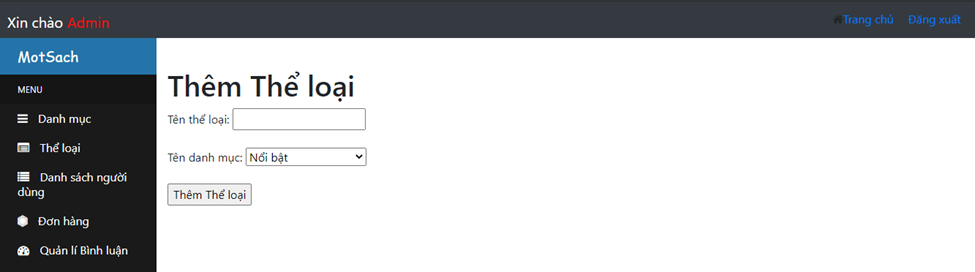
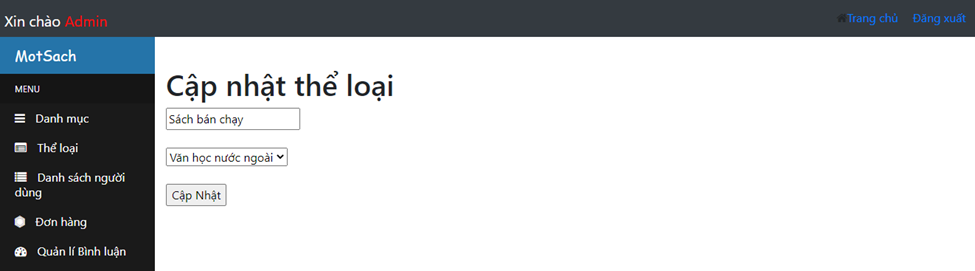
Book Product Management Page
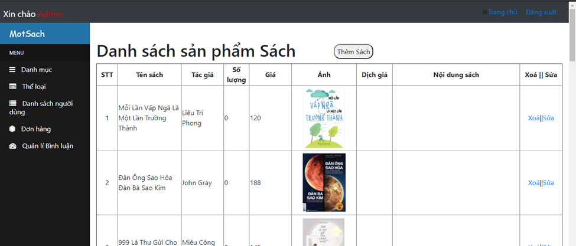
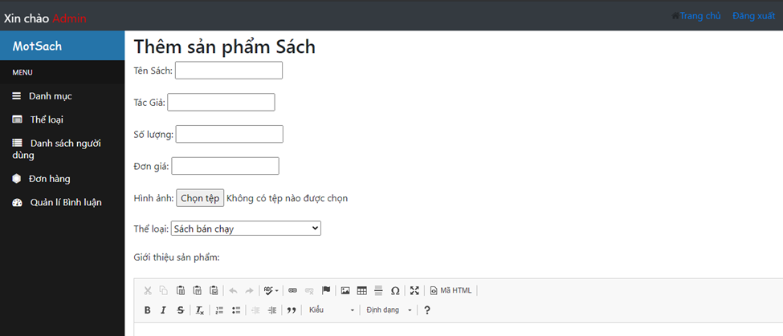
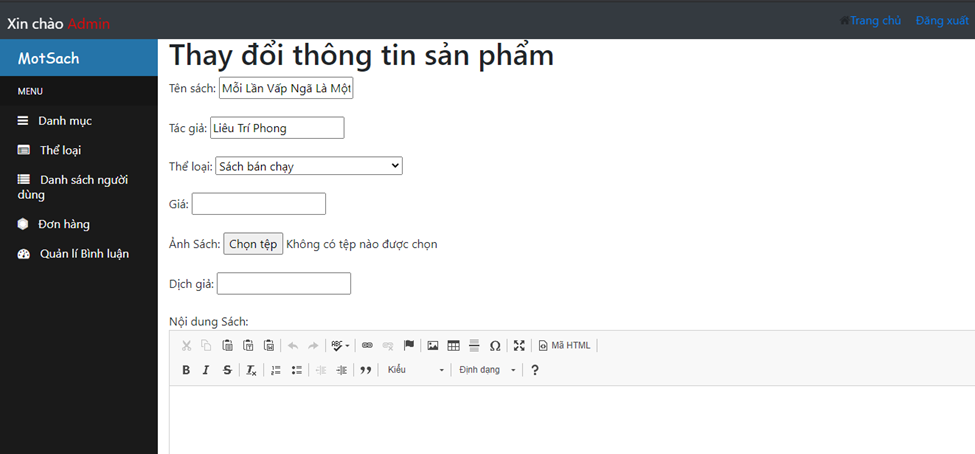
User Management Page
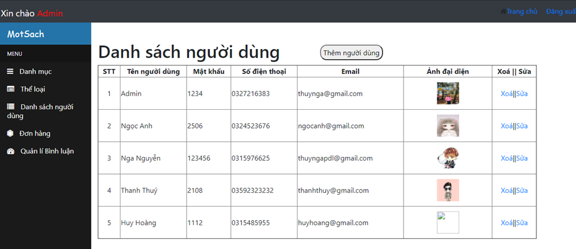
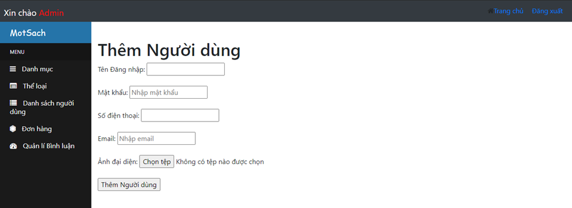
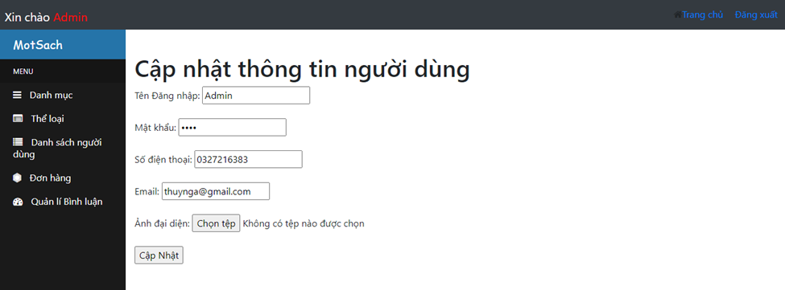
Comment Management Page
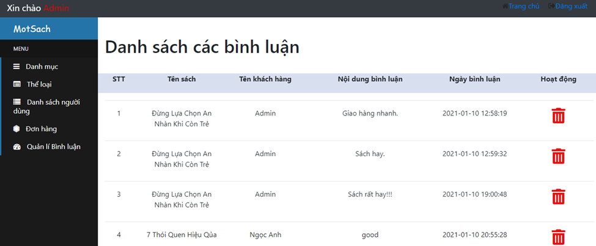
Order Management Page
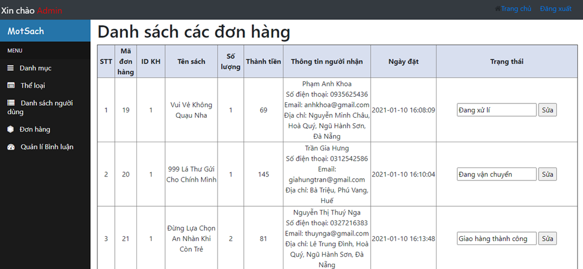

